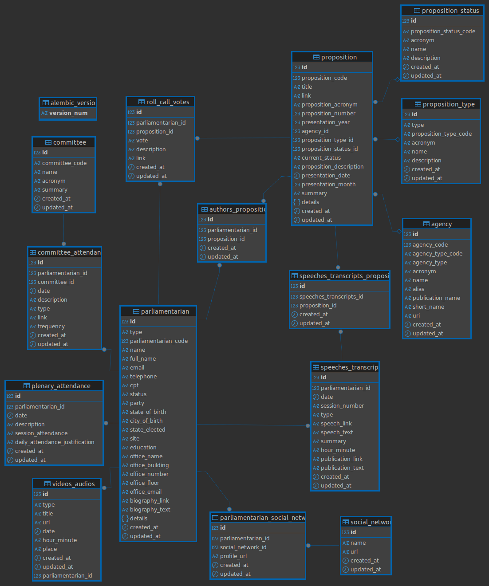

# 🐘 Mamute-Politico

Monorepo do projeto Mamute Político (Correio Sabiá), com coleta de dados legislativos, API pública, interface web (SPA), backend de chatbot e integração com autenticação via **Ghost** (CMS / portal de membros).

## Programas do repositório

- `mamute_scrappers` (coleta e sincronização de dados): [`mamute_scrappers/README.md`](mamute_scrappers/README.md)
- `api` (API FastAPI de dados legislativos): [`api/README.md`](api/README.md)
- `chatbot_backend` (chatbot com RAG + pgvector): [`chatbot_backend/README.md`](chatbot_backend/README.md)
- `ui` (interface web React): [`ui/README.md`](ui/README.md)
- `environments` (Caddy + Docker Compose por ambiente): pasta [`environments/`](environments/) 

## Stack Docker em produção

O ficheiro [`environments/production/docker-compose.yml`](environments/production/docker-compose.yml) define o compose **`mamute-politico-ui-prod`** com os seguintes serviços:

| Serviço | Função |
|---------|--------|
| **`caddy`** | Proxy reverso na porta `CADDY_HTTP_PORT` (por omissão 80). Monta o [`Caddyfile`](environments/production/Caddyfile) e volumes de dados/configuração do Caddy. |
| **`ui`** | Imagem construída a partir de [`ui/Dockerfile`](ui/Dockerfile) (build estático do front). O Caddy encaminha o tráfego com prefixo `/app` para o contentor `ui:8080`. |
| **`mamute-politico-chatbot`** | Backend do chatbot (build em `chatbot_backend`), com `chatbot_backend/.env` montado em `/app/.env`. O Caddy encaminha `/chat*` para a porta 8000 deste serviço. |
| **`ghost-db`** | MySQL 8 para a base de dados do Ghost. Palavra-passe root e nome da BD vêm de variáveis (ver [`environments/production/.env.example`](environments/production/.env.example)). |
| **`ghost`** | Ghost em produção; `url` definida por `PUBLIC_URL`; liga-se ao MySQL em `ghost-db`. Conteúdo persistente em volume `ghost_content`. |

**Redes:** `frontend` agrega Caddy, UI, chatbot e Ghost (face ao utilizador). `backend` isola o MySQL; o Ghost está em `frontend` e `backend` para falar com a base de dados.

**Nota:** este compose de **produção não inclui o serviço `api`** (FastAPI de dados). O [`Caddyfile` de produção](environments/production/Caddyfile) também **não** define rota `/api*` — apenas `/app*`, `/chat*` e o restante para o Ghost. Ou seja, a API de dados deve ser exposta por outro deploy (outro compose, Kubernetes, etc.) ou o compose/Caddy precisam de ser estendidos. Já o compose de [**desenvolvimento**](environments/development/docker-compose.yml) inclui `mamute-politico-api` e o [Caddy de dev](environments/development/Caddyfile) encaminha `/api*` para esse serviço.

## Inicialização rápida (local)

1. Clone o repositório e entre na pasta raiz.
2. Configure e execute os scrappers primeiro (para popular/atualizar o banco).
3. Suba a API (`api`) para expor os dados coletados.
4. Suba o backend do chatbot (`chatbot_backend`) para as rotas de pergunta e streaming.
5. (Opcional) Rode a interface em `ui/` com `npm ci` e `npm run dev`, configurando `VITE_BASE_URL` para a mesma origem em que o navegador acessa a API e o Ghost (veja a seção [Interface web (ui)](#interface-web-ui)).

## Ordem recomendada de execução

1. `mamute_scrappers` → migrações + coleta/sincronização.
2. `api` → leitura do banco.
3. `chatbot_backend` → indexação vetorial + serviço de chat.
4. `ui` → front-end (após API e, se usar o chat na interface, o chatbot).

## Links rápidos

- [README dos Scrappers](mamute_scrappers/README.md)
- [README da API](api/README.md)
- [README do Chatbot Backend](chatbot_backend/README.md)
- [README da interface (UI)](ui/README.md)
- [Compose de produção](environments/production/docker-compose.yml) · [Compose de desenvolvimento](environments/development/docker-compose.yml)

## Diagrama

